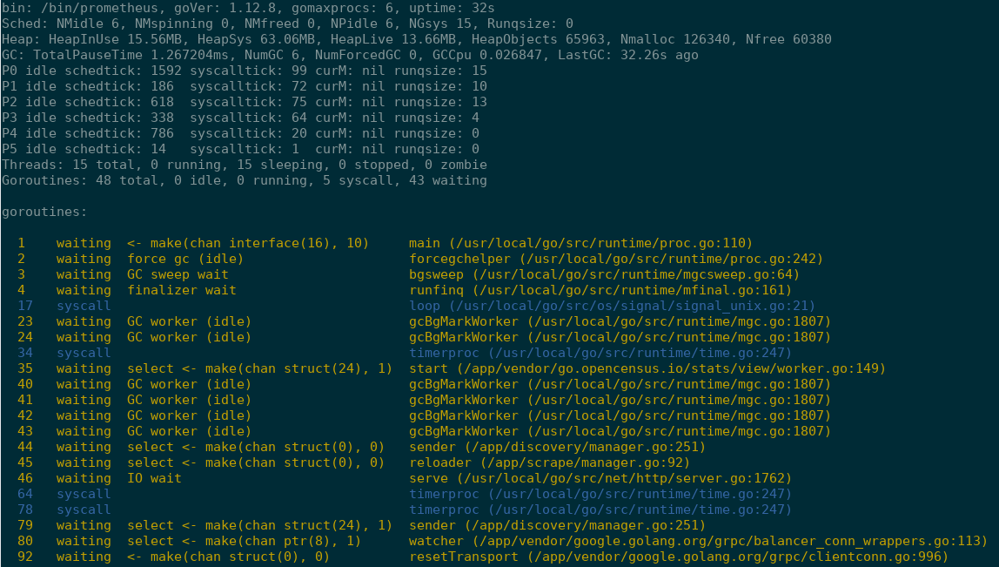
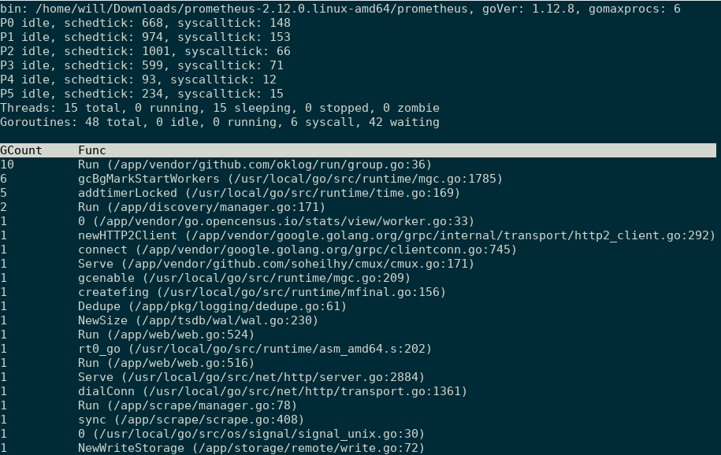

# gospy: Non-Invasive goroutine inspector

A tiny tool to inspect your go process's goroutine info, without single line change in your code. Inspired by [py-spy](https://github.com/benfred/py-spy),
learned a lot from [delve](https://github.com/go-delve/delve)

## Usage

### summary

`sudo ./gospy summary  --pid 1234`

###  top

 aggregate goroutines by functions: `sudo ./gospy top --pid 1234`

### var

dump a global variable value by name: `sudo ./gospy var --pid 1234 --name runtime.ncpu`

    type: int32, value: 6
    
 Support types:
 
- int(8, 16, 32, 64)
- uint(8, 16, 32, 64)
- bool
- string

### heap

dump runtime heap info: `sudo ./gospy heap --pid 1234`

    
    PagesInUse: 918, PagesSwept: 977
    Large Object(>32KB) Stats: AllocNum: 21, AllocRamSize: 4.52MB, FreeNum: 16, FreedRamSize: 3.38MB
    SweepDone: 1, Sweepers: 0, Sweepgen: 82
    P0, FlushGen:82:
            Tiny size object(<16B): AllocNum: 9, BytesUsage: 11/16
            Large size object freed(>32KB): FreeNum: 0, FreedRamSize: 0B
            Small size object(<32KB):
                    0B~8B: npages: 1, allocCount: 114
                    8B~16B: npages: 1, allocCount: 259
                    16B~32B: npages: 1, allocCount: 146
                    32B~48B: npages: 1, allocCount: 21
                    48B~64B: npages: 1, allocCount: 40
                    64B~80B: npages: 1, allocCount: 88
                    80B~96B: npages: 1, allocCount: 76
                    96B~112B: npages: 1, allocCount: 17
                    112B~128B: npages: 1, allocCount: 48
                    144B~160B: npages: 1, allocCount: 26
                    160B~176B: npages: 1, allocCount: 13
                    176B~192B: npages: 1, allocCount: 14
                    208B~224B: npages: 1, allocCount: 24
                    240B~256B: npages: 1, allocCount: 19
                    256B~288B: npages: 1, allocCount: 15
                    288B~320B: npages: 1, allocCount: 16
                    352B~384B: npages: 1, allocCount: 19
                    480B~512B: npages: 1, allocCount: 14
                    512B~576B: npages: 1, allocCount: 1
                    576B~640B: npages: 1, allocCount: 5
                    704B~768B: npages: 1, allocCount: 6
                    768B~896B: npages: 1, allocCount: 7
                    896B~1.00KB: npages: 1, allocCount: 2
                    1.00KB~1.12KB: npages: 1, allocCount: 4
                    1.12KB~1.25KB: npages: 1, allocCount: 3
                    1.25KB~1.38KB: npages: 2, allocCount: 8
                    2.00KB~2.25KB: npages: 2, allocCount: 5
                    4.75KB~5.25KB: npages: 2, allocCount: 3
    P1, FlushGen: 82:
        ...

## Target process go version compatibility

Works on target go version >= 1.10, the DWARF info in binary is different before 1.10: https://golang.org/doc/go1.10#compiler.
Current code won't work.

tested:

- [x] 1.10.X
- [x] 1.11.X
- [x] 1.12.X 
- [x] 1.13.X
- [x] 1.14.X
- [x] 1.15.x
- [x] 1.16.x

## Build from source

Minium go version to build: 1.13.0

git clone https://github.com/monsterxx03/gospy.git

gospy is based on go module, please don't put repo under GOPATH, it won't work.

cd gospy && make

binary will be created under gospy/bin/

## Limitation

- x86_64 linux only
- Don't work with binaries without debug info, if you build with linker flag `-w -s`, gospy won't be able to figure out function/variable names. 

If binary is build with  `-buildmode=pie`, only support go >= 1.15. Since .gopclntab is missing in PIE mode before 1.15.

## FAQ

#### How it works?

Read DWARF ino from ELF binary(embed by go compiler), parse some basic global variables'(runtime.allgs, runtime.allglen...) virtual memory address, then read target process's memory space to recreate runtime structs(runtime.g, runtime.p, runtime.m, runtime.sched...)

#### How to read remote process's memory space?

There're three ways:

- `PTRACE_PEEKDATA`, it can only read a long word(8 bytes) at a time. If we want to read a continuous memory space, need to call it multi times.
- `process_vm_readv`, available after kernel 3.2, can read a continuous block of process memory space, not exposed directly in go, maybe need cgo to call?
- Read `/proc/{pid}/mem` directly, it's the easiest way on linux. Also more efficient than a syscall in go. 

gospy takes the third way(`/proc/{pid}/mem`). Bad side is sudo privilege is required.

#### Is there any overhead on remote process?

Yes. By default, gospy use `PTRACE_ATTACH` to suspend target process to get a consistent memory view, after reading, `PTRACE_DEATCH` to resume target process.

If `--non-blocking` option is provided, gospy will do memory reading directly, won't suspend target process. If target process is creating/destorying goroutines actively, it may fail during reading memory.

#### If target process's binary is striped, any workaround without restarting target process?

You can compile a binary with debug info and specify the `--bin` option. Ensure compile with same code revision, same go version.

#### Can gospy spy itself?

Yes :)

#### Debug process running in k8s pod?

- kubectl cp bin/gospy pod-xxx:/tmp/gospy
- kubectl exec -it pod-xxx -- /tmp/gospy top --pid 1

### Use as a lib

go get github.com/monsterxx03/gospy

    
    import (
        "fmt"
        "github.com/monsterxx03/gospy/pkg/proc"
    )

    func main() {
        p, _ := proc.New(14791, "")
        ver, _ := p.GoVersion()
        fmt.Println(ver) // print target process go version
        sum, _ := p.Summary(true)
        fmt.Println(sum)
        for _, g := range sum.Gs {
            fmt.Println(g)
        }
    }

## TODO

- Support dump more variable types
- Optimize performance
