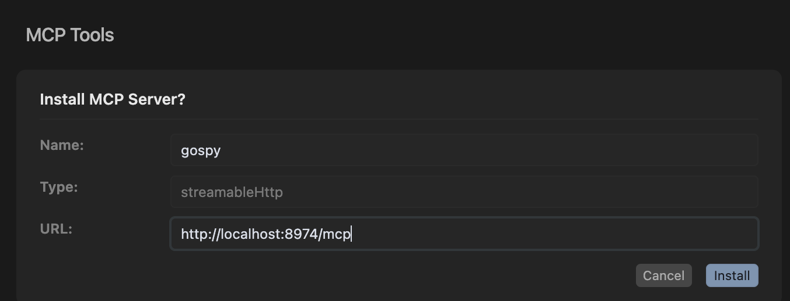

# Go Process Inspector

[](https://smithery.ai/server/@monsterxx03/gospy)
[](https://goreportcard.com/report/github.com/monsterxx03/gospy)
[](LICENSE)
[](https://cursor.com/install-mcp?name=gospy&config=eyJ1cmwiOiJodHRwOi8vbG9jYWxob3N0Ojg5NzQvbWNwIn0%3D)

A tool for inspecting and analyzing running Go processes, including goroutine states, memory statistics, and binary information.

## Features

- View detailed goroutine information (status, scheduling info)
- Analyze process memory statistics
- Cross-platform support (Linux and macOS)
- Terminal UI for interactive inspection
- HTTP API for programmatic access
- mcp server

## Installation

### Installing via Smithery

To install Go Process Inspector for Claude Desktop automatically via [Smithery](https://smithery.ai/server/@monsterxx03/gospy):

```bash
npx -y @smithery/cli install @monsterxx03/gospy --client claude
```

### Manual Installation
```bash
go install github.com/monsterxx03/gospy@latest
```

## Usage

### CLI Interface

```bash
# Interactive terminal UI
sudo gospy top --pid <pid>

# HTTP API server
sudo gospy serve --port 8974

# Get process summary
sudo gospy summary --pid <pid>

# Get process summary in JSON format
sudo gospy summary --pid <pid> --json
```

#### Summary Command Options
- `--pid/-p` - Target process ID (required)
- `--bin/-b` - Path to binary file (optional)
- `--json/-j` - Output results in JSON format

### API Endpoints

- `GET /goroutines?pid=<pid>` - List all goroutines
- `GET /memstats?pid=<pid>` - Get memory statistics
- `GET /runtime?pid=<pid>` - Get runtime version info

### MCP Server

The MCP server provides an http (streamableHTTP) endpoint. To enable:

```bash
>>> sudo gospy serve --enable-mcp --port 8974

Starting API server on port 8974
Endpoints:
  GET /runtime?pid=<PID>     - Get runtime info
  GET /goroutines?pid=<PID> - Get goroutines list
  GET /memstats?pid=<PID>   - Get memory stats
  GET /mcp   - MCP http endpoint

```

Available MCP tools:
- `goroutines` - Dump goroutines for a go process
- `gomemstats` - Dump memory stats for a go process
- `goruntime`  - Dump runtime info for a go process
- `pgrep`      - Find pid from process name

Config in cursor




### Terminal UI Controls

- `q` - Quit
- `r` - Refresh data
- `s` - Suspend/Resume top view
- `/` - Search/filter goroutines

### Terminal UI Screenshot


## Building from Source

```bash
git clone https://github.com/monsterxx03/gospy.git
cd gospy
make
```

## Requirements

- Go 1.20+
- Linux or macOS (Apple Silicon only)
- Root privileges (required for memory access)

## Root Privileges

gospy requires root privileges to:
- Read process memory (/proc/<pid>/mem on Linux)
- Access Mach APIs on macOS

Run with sudo:
```bash
sudo gospy top --pid <pid>
```

For development/debugging, you may want to:
1. Build the binary first: `make`
2. Run with sudo: `sudo ./gospy [command]`

## Credits

Version 0.7.0 was completely rewritten from scratch with [aider](https://aider.chat), which wrote >90% of the code. Additional assistance from:
- [DeepSeek](https://deepseek.com) (R1 + V3 models) - AI coding assistant

Total AI compute cost: ~$2 USD

## License

MIT - See [LICENSE](LICENSE) file for details.
